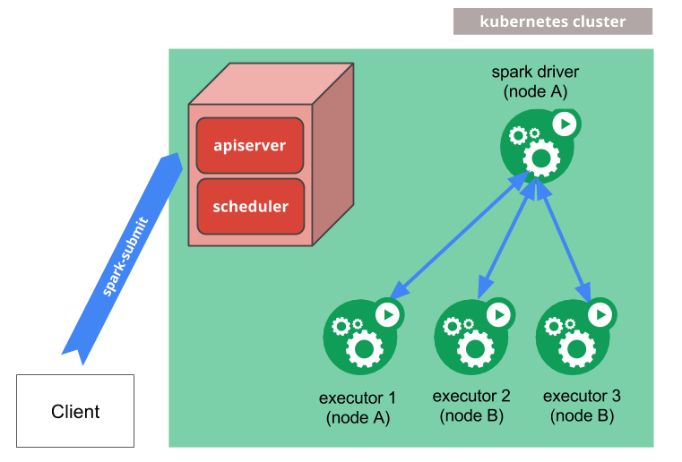

# Spark-on-K8s POC
## Overview
Lorem ipsum.

## Components

- Spark Client
- Kubernetes Cluster - Minikube

## Installation
1. Install Minikube as our local kubernetes cluster. Also install `kubectl` to help us interact with Kubernetes cluster.
   ```bash
   # Linux
   curl -LO https://github.com/kubernetes/minikube/releases/latest/download/minikube-linux-amd64
   sudo install minikube-linux-amd64 /usr/local/bin/minikube && rm minikube-linux-amd64

   curl -LO "https://dl.k8s.io/release/$(curl -L -s https://dl.k8s.io/release/stable.txt)/bin/linux/amd64/kubectl"
   sudo install -o root -g root -m 0755 kubectl /usr/local/bin/kubectl
   ```
2. Start Minikube cluster with sufficient resources and enable Docker environment within Minikube.
   ```bash
   minikube start --cpus=4 --memory=8192 --driver=docker
   eval $(minikube docker-env)
   ```
3. *(Optional)* Create new K8s namespace for your Spark app. You can pick your own preferences for this.
   ```bash
   kubectl create namespace {SPARK_NAMESPACE}
   ```
4. Set up RBAC and ServiceAccount to give Spark permissions to create pods.
   ```bash
   kubectl apply -f - <<EOF
   apiVersion: v1
   kind: ServiceAccount
   metadata:
      name: spark
      namespace: {SPARK_NAMESPACE}
   ---
   apiVersion: rbac.authorization.k8s.io/v1
   kind: ClusterRoleBinding
   metadata:
      name: spark-role
   roleRef:
      kind: ClusterRole
      name: edit
      apiGroup: rbac.authorization.k8s.io
   subjects:
   - kind: ServiceAccount
     name: spark
     namespace: {SPARK_NAMESPACE}
   EOF
   ```


## Submitting Spark Jobs
There are many ways of submitting Spark jobs into K8s cluster. Below is some of the possible methods.

### Using spark-submit
We can use spark-submit script in Spark’s bin directory to launch applications on a K8s cluster. This is the most common and flexible way to submit a Spark job.
1. Install Spark on our local as Spark client to submit the job into our K8s cluster.
   ```bash
   # Using Spark 3.5.5
   curl -LO https://dlcdn.apache.org/spark/spark-3.5.5/spark-3.5.5-bin-hadoop3-scala2.13.tgz
   tar -xvzf spark-3.5.5-bin-hadoop3-scala2.13.tgz && rm spark-3.5.5-bin-hadoop3-scala2.13.tgz
   ```
2. *(Optional)* 

### Using spark-kubernetes-operator
1. Install Helm chart for spark-kubernetes-operator.
   ```bash
   # Install Helm - Linux
   curl https://baltocdn.com/helm/signing.asc | gpg --dearmor | sudo tee /usr/share/keyrings/helm.gpg > /dev/null
   sudo apt-get install apt-transport-https --yes
   echo "deb [arch=$(dpkg --print-architecture) signed-by=/usr/share/keyrings/helm.gpg] https://baltocdn.com/helm/stable/debian/ all main" | sudo tee /etc/apt/sources.list.d/helm-stable-debian.list
   sudo apt-get update
   sudo apt-get install helm

   # Install chart for spark-kubernetes-operator
   helm repo add spark-kubernetes-operator https://apache.github.io/spark-kubernetes-operator
   helm repo update
   helm install spark-kubernetes-operator spark-kubernetes-operator/spark-kubernetes-operator
   ```

### Using Apache Livy

### Using Apache Airflow
